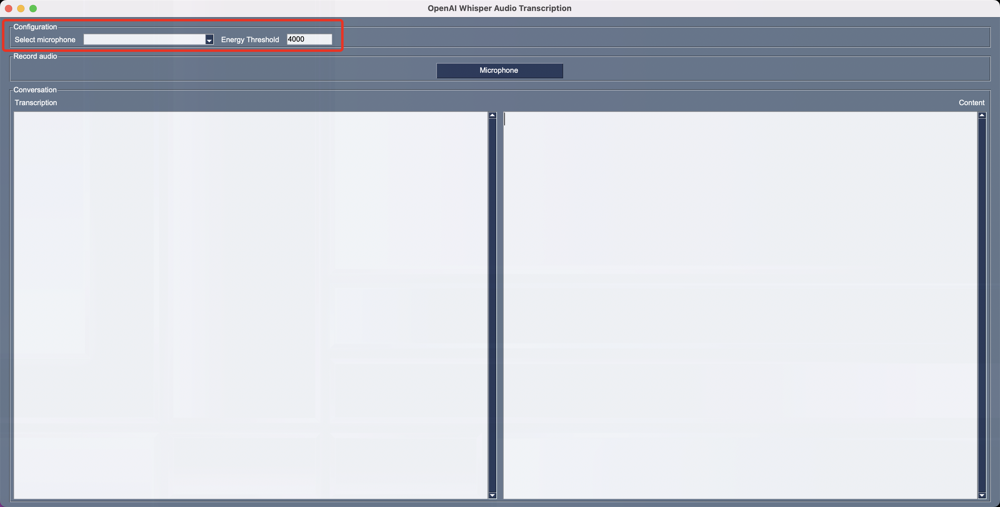

# Start the Home Assistant

## Clone the repository

1. Install Git from https://git-scm.com/downloads.
2. Clone the repository:

    ```bash
    git clone https://github.com/gloveboxes/OpenAI-Whisper-Transcriber-Sample
    ```

## Cloud API Keys

The Home Assistant uses the following cloud services:

1. [OpenAI](https://platform.openai.com) chat and depending on your configuration, the `Whisper` speech to text transcriber. The OpenAI API key is used to call the OpenAI Chat Completion API and extracting OpenAI Functions.
2. The [Weather API](https://www.weatherapi.com/) to get weather data. This data is used to `ground` the GPT prompts the assistant generates.

Next you will need to create accounts and get API keys for the cloud services. The API keys are stored in a `.env` file in the `client` folder of the repo you cloned. As you create the API keys, add them to the `.env` file.

### OpenAI API

Create an OpenAI account and get an API key.

1. Sign up for an OpenAI account at https://platform.openai.com.
2. Create an API key at https://platform.openai.com/account/api-keys.
3. Update the OPENAI_API_KEY key in the `.env` file with the API key.
4. Save the updated `.env` file.

### Weather API

Create a Weather API account and get an API key.

1. Sign up for a [Weather API account](https://www.weatherapi.com/signup.aspx).
2. Create a free [Weather API key](https://www.weatherapi.com/my/).
3. Update the WEATHER_API_KEY key in the `.env` file with the API key.
4. Save the updated `.env` file.

## Install prerequisites

1. Install [Python](https://www.python.org/downloads) version 3.8 ~ 3.10. The [Whisper library](https://pypi.org/project/openai-whisper/) is supported on Python 3.8 to 3.10.
1. Install the required Python packages:
1. Create a Python virtual environment:

    Windows

    ```pwsh
    python -m venv .assistant
    ```

    Linux and macOS

    ```bash
    python3 -m venv .assistant
    ```

2. Activate the Python virtual environment:

    Windows

    ```pwsh
    ./.assistant/Scripts/activate
    ```

    Linux and macOS

    ```bash
    source .assistant/bin/activate
    ```

3. Install the required Python packages:

    ```bash
    pip install -r requirements.txt
    ```

4. On Windows, by default, the `requirements.txt` file will install the CPU version of PyTorch. If you have an NVidia GPU, you can install the CUDA accelerated version of PyTorch.

    1. First uninstall the CPU version of PyTorch:

        ```pwsh
        pip3 uninstall torch torchvision torchaudio
        ```

    2. Install the CUDA accelerated version of PyTorch:

        Review the [PyTorch website](https://pytorch.org/get-started/locally/) for the latest installation instructions.

        ```bash
        pip3 install torch torchvision torchaudio --index-url https://download.pytorch.org/whl/cu117
        ```

## Set the Text to Speech Transcriber mode

There are three modes to use Whisper speech to text transcriber. The default mode is `local`. You can change the mode by updating the `WHISPER_MODE` key in the `.env` file.

1. `local`: The Whisper speech to text transcription is done locally on the device. This is the default mode and free mode. The speed will depend on the hardware capabilities of your computer. The first time the Whisper speech to text transcriber is used, it will download the transcriber model from the internet. This will take a few minutes.
2. `openai`: The Whisper speech to text transcription is done using the OpenAI API Audio service which maybe a lot faster that transcribing speech on your computer. This is a paid service, review [OpenAI Audio Model Pricing](https://openai.com/pricing/) for more information.
3. `gpu`: You can run a Whisper REST endpoint on your own NVidia GPU. For more information, review the [Whisper REST API](../Whisper-Server/Whisper-Server-Setup) docs.

## Run the home assistant app

1. Ensure the Python virtual environment is activated.
2. From the command line, change to the `client` folder of the repo you cloned.
3. Run the home assistant app:

    ```bash
    python assistant.py
    ```
4. The App will start, select your preferred microphone from the dropdown menu.

    

5. You can tweak the `Energy Threshold`. The Energy Threshold represents the energy level threshold for sounds. Values below this threshold are considered silence, and values above this threshold are considered speech. For more information on this setting, review [recognizer_instance.energy_threshold](https://github.com/Uberi/speech_recognition/blob/master/reference/library-reference.rst#recognizer_instanceenergy_threshold--300---type-float).
6. Press `Microphone` button to start listening for your voice commands. Try out a few commands like:

    1. What's the weather in Seattle
    2. How can you help me
    3. Turn on the living room lights
