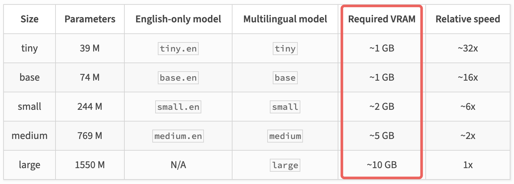

# Ubuntu with an NVidia GPU

The recommended configuration for running the OpenAI Whisper sample on Ubuntu is:

1. The Whisper Transcriber Service was tested on Ubuntu 20.04 LTS.
1. Ubuntu 20.04 includes Python 3.8.

    As At June 2023, the [OpenAI Whisper library](https://pypi.org/project/openai-whisper/) is compatible with Python 3.8-3.10

2. An NVidia GPU with 10 to 12 GB of VRAM. But you can run smaller Whisper models on GPUs with less VRAM.
3. A modern CPU with 16 GB of RAM. With a GPU, the CPU is not heavily used, but you need enough RAM to run the OS and the Whisper Transcriber Service.

### Install the NVidia GPU Drivers

1. Install the NVidia GPU drivers. See the [NVidia website](https://www.nvidia.com/Download/index.aspx) for instructions.

## Install Ubuntu prerequisites

1. Ensure the Ubuntu system is up to date.
   1. Open a terminal window.
   2. Run:
        ```bash
        sudo apt update && sudo apt upgrade
        ```
   3. Restart if necessary.
2. Install the dependencies. 
   1. Run:
        ```bash
        sudo apt install ffmpeg python3-pip python3-venv
        ```
   2. Test FFmpeg. Run `ffmpeg -version`, the command should return the FFmpeg version.


## Start the Whisper Transcriber Service

1. From a terminal window.
2. Clone the Whisper Transcriber Sample to your preferred repo folder.

    ```bash
    git clone https://github.com/gloveboxes/OpenAI-Whisper-Transcriber-Sample.git
    ```

3. Navigate to the `server` folder.

    ```bash
    cd OpenAI-Whisper-Transcriber-Sample/server
    ```

4. Create a Python virtual environment.

    :::danger
    At the time of writing (June 2023), the [Whisper Python library](https://pypi.org/project/openai-whisper) is supported on Python 3.8 to 3.10. The Whisper library worked on Python 3.11.3, but not Python 3.11.4. Be sure to check the version of Python you are using `python3 --version`.
    :::

    ```bash
    python3 -m venv .whisper-venv
    ```

5. Activate the Python virtual environment.

    ```bash
    source whisper-server/bin/activate
    ```

6. Install the required Python libraries.

    ```bash
    pip3 install -r requirements.txt
    ```

7. Test that CUDA/GPU is available to PyTorch.

   Run the following command, if CUDA is available, the command will return `True`.

    ```bash
    python3 -c "import torch; print(torch.cuda.is_available())"
    ```

8. Review the following chart is taken from the [OpenAI Whisper Project Description](https://pypi.org/project/openai-whisper/) page and select the model that will fit in the VRAM of your GPU. At the time of writing, Whisper multilingual models include `tiny`, `small`, `medium`, and `large`, and English-only models include `tiny.en`, `small.en`, and `medium.en`.
   

9.  Update the `server/config.json` file to set your desired Whisper model. For example, to use the `medium` model, set the `model` property to `medium`.

    ```json
    { "model": "medium" }
    ```

10.  Start the Whisper Transcriber Service. From the command line, run:

        ```bash
        uvicorn main:app --port=5500
        ```

        Once the Whisper Transcriber Service starts, you should see output similar to the following.

        ```text
        [2023-06-04 18:53:46.194411] Whisper API Key: 17ce01e9-ac65-49c8-9cc9-18d8deb78197
        [2023-06-04 18:53:50.375244] Model: medium loaded.
        [2023-06-04 18:53:50.375565] Ready to transcribe audio files.
        ```

11.  The `Whisper API Key` will be also be displayed. Save the `Whisper API Key` somewhere safe, you'll need the key to configure the Whisper client.

    ```text
    Whisper API Key: <key>
    ```

12. To stop the Whisper Transcriber Service, press `CTRL+C` in the terminal.
13. To deactivate the Python virtual environment, run `deactivate`.
